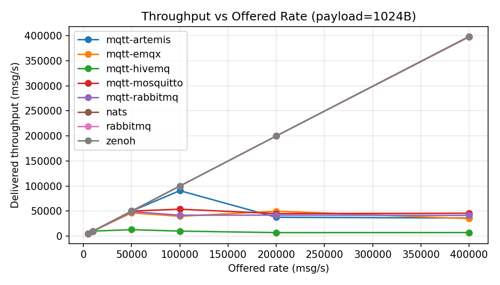
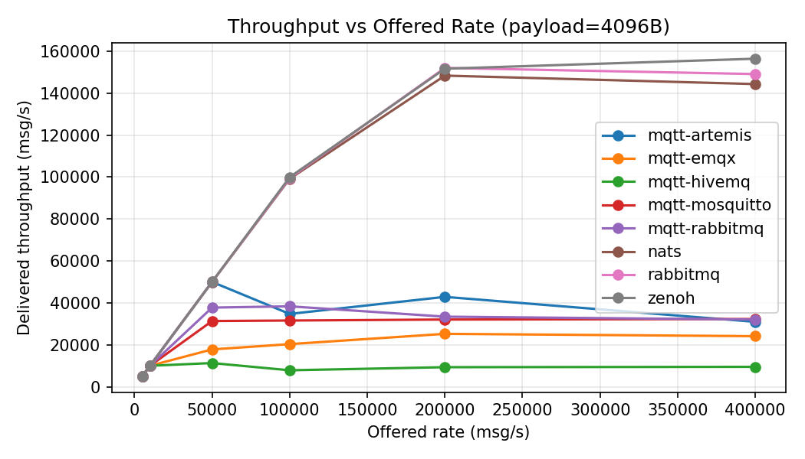
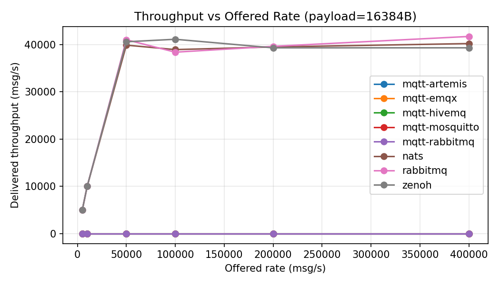
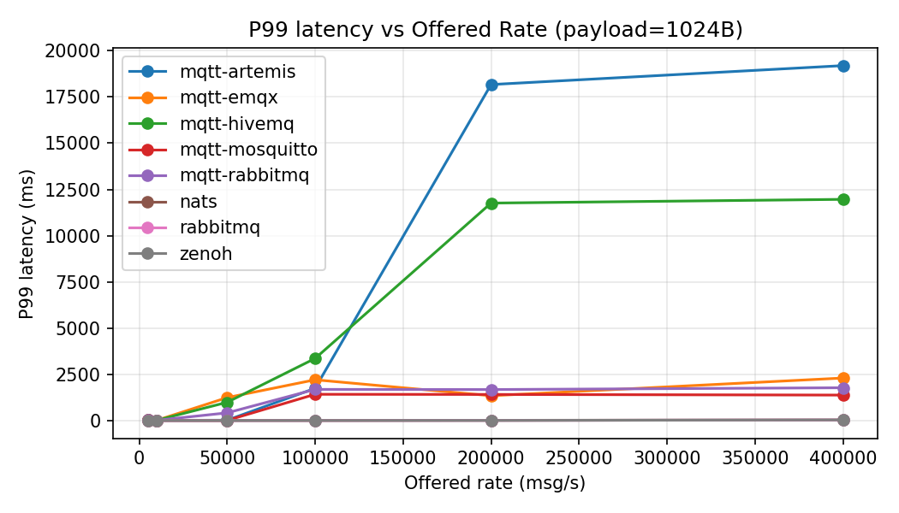
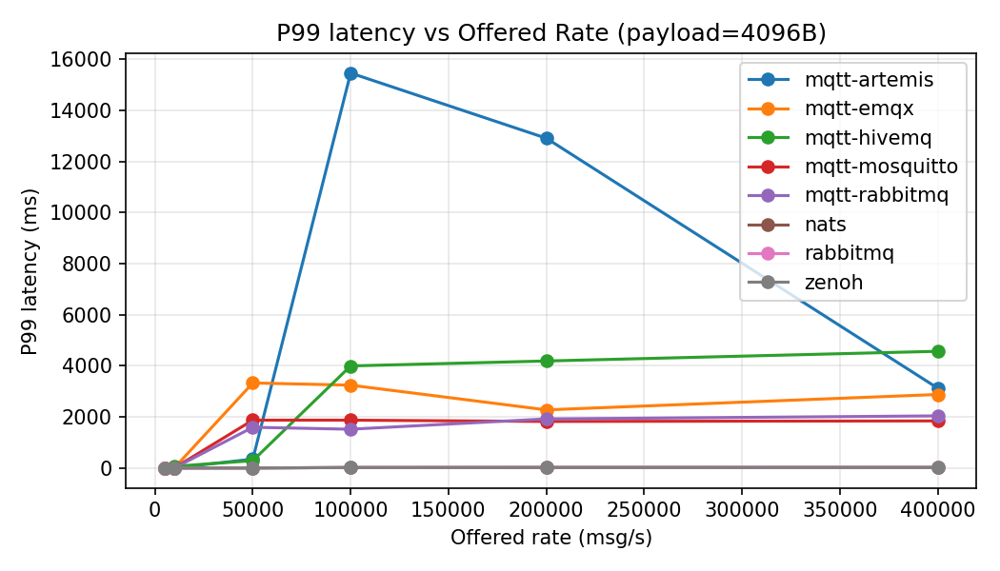
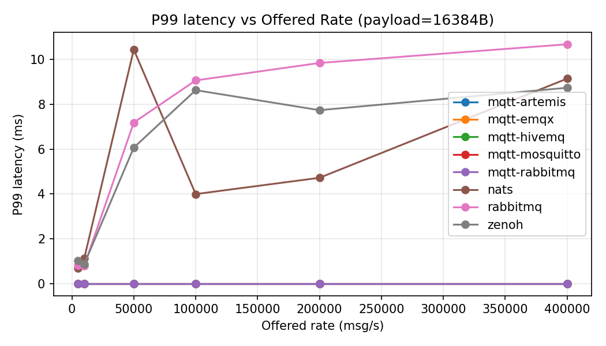
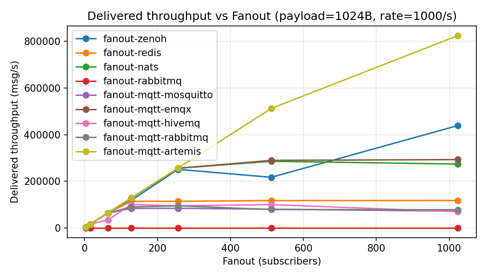
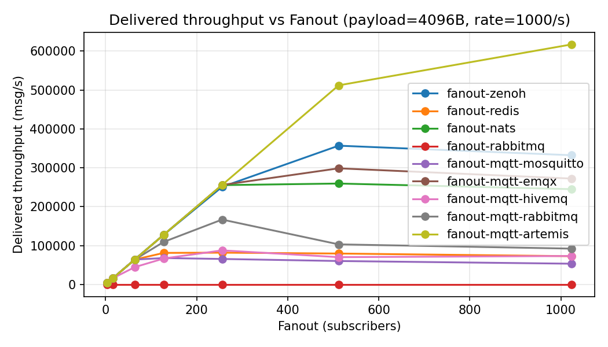
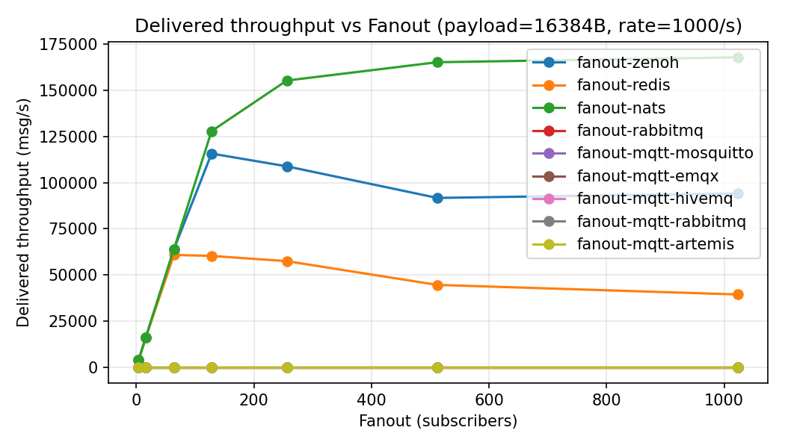

# Benchmark report — 2025-09-10 01:52:18

Data source: [raw_data/summary.csv](raw_data/summary.csv)

## Executive summary

- 1 KB leaders: Zenoh, NATS, RabbitMQ sustain ~400k msg/s with p95 ≈ 20–26 ms and modest drops.
- 4 KB ceiling: throughput flattens ~150–160k msg/s across Zenoh/NATS/RabbitMQ; p95 ~21–26 ms.
- 16 KB wall: simple pub/sub saturates near ~40k msg/s; tails grow under load.
- MQTT variability: Mosquitto/Artemis handle 50k best; EMQX/HiveMQ queue hard at ≥50k–100k (p95 in seconds) and shortfalls.
- MQTT 16 KB broken end-to-end (recv=0 across brokers/fanout) → likely packet/frame-size config.
- Fanout: Zenoh/NATS scale to ~s256 at 1 KB; at s≥512 and larger payloads, latency tails spike. MQTT fanout: Artemis/EMQX scale; HiveMQ tails grow large.
- RabbitMQ fanout: no data (all zeros) → harness/wiring not implemented.

## Throughput vs offered rate

### payload=1024B

_Notes: Zenoh/NATS/RabbitMQ track offered rate up to ~400k msg/s with modest drops. MQTT varies—Artemis/Mosquitto strongest; EMQX/HiveMQ fall off at ≥50k–100k._

### payload=4096B

_Notes: All three (Zenoh/NATS/RabbitMQ) flatten around ~150–160k msg/s. MQTT Artemis holds best; Mosquitto ~31–42k, EMQX ~18–33k, HiveMQ often collapses._

### payload=16384B

_Notes: Zenoh/NATS/RabbitMQ saturate near ~40k msg/s. MQTT shows recv=0 across brokers (non-functional at 16 KB)._ 

## P99 latency vs offered rate

### payload=1024B

_Notes: Zenoh/NATS/RabbitMQ p99 ≲ ~36 ms even at 400k. MQTT p99 spikes (EMQX/HiveMQ worst) at ≥50k–100k; Artemis is best among MQTT but still elevated._

### payload=4096B

_Notes: p99 ~21–26 ms near the ~150–160k ceiling for Zenoh/NATS/RabbitMQ. MQTT Artemis stays reasonable; others trend higher/unstable._

### payload=16384B

_Notes: Zenoh/NATS/RabbitMQ maintain low p99 at ≤~40k; MQTT has no deliveries at 16 KB (no latency data)._ 

## Fanout (delivered throughput, rate=1000/s)

### payload=1024B

_Notes: Zenoh/NATS scale near-linearly to s≈256; degrade at s≥512. MQTT Artemis/EMQX strong; HiveMQ drops at higher s. Redis plateaus after ~s64. RabbitMQ fanout = 0 (not wired)._ 

### payload=4096B

_Notes: Similar shape but earlier degradation: Zenoh/NATS deliver well to s≈128–256; MQTT Artemis/EMQX OK; HiveMQ drops; Redis declines beyond s64._

### payload=16384B

_Notes: Zenoh/NATS deliver but with reduced scaling; Redis OK to ~s64 then declines. MQTT fanout at 16 KB shows zero deliveries (broken path)._ 

## Notable anomalies

- MQTT 16 KB: recv=0 for all brokers (simple + fanout). Likely exceeded max packet/frame or client buffer limits.
- RabbitMQ fanout: all zeros across s/payloads → missing exchange/queue wiring in fanout harness.
- High fanout (s≥512): seconds-level p95/p99 for larger payloads due to open-loop publishing and queue growth.

## Recommendations

- Fix MQTT large payloads: raise client/broker max packet/frame sizes; verify QoS/inflight/receive_maximum.
- Implement RabbitMQ fanout wiring (topic/fanout exchange + bindings); ensure consumers ready before publish.
- Add optional backpressure/closed-loop or queue-depth guard to reduce tail blowups at high fanout.
- Broker/OS tuning for large fanout: fd limits, TCP buffers, CPU pinning, and per-transport batching.
