## Benchmark report: 2025-09-10 07:34:42

> ⚠️ **Disclaimer:** Analysis text was generated by AI and may contain inaccuracies. The underlying measurements and plots are from the referenced run and are real.

- Dataset: `/home/cc/mq-bench/example_results/benchmark_20250910_073442/raw_data/summary.csv`
- Figures: all images in `./plots/`
- Transports: zenoh, zenoh-peer, nats, redis (pub/sub), rabbitmq
- Payloads: 1024B, 4096B, 16384B; Offered rates up to 400k msg/s; single pub-sub path

### TL;DR highlights

- Throughput ceilings drop with larger payloads. With 1 KB payloads, zenoh delivered ≈398k/s at 400k offered (p99 ≈30 ms), NATS ≈268k/s (p99 ≈26 ms), zenoh-peer ≈338k/s (p99 ≈24 ms). With 16 KB payloads, most systems plateau around 35–41k/s.
- Latency stays low at modest rates (sub-ms to a few ms). Near saturation, p99 rises to tens of milliseconds for high-throughput systems. RabbitMQ shows seconds-level p99 when overdriven.
- CPU scales steeply with rate for NATS and zenoh; redis remains moderate CPU but is throughput-limited (~4–8k/s). Memory usage is generally flat; Redis ≈60 MB, RabbitMQ hundreds of MB, others just a few MB.
- RabbitMQ throughput remained ~12–15k/s regardless of offered rate, with very high queueing latency when overloaded.

Notes: “Max CPU%” reflects the recorder’s view and can exceed 100% on multi-core; zenoh-peer’s CPU numbers are extremely low in this run, likely due to measurement scope (where CPU was sampled), but trends are still informative.

---

## Throughput vs Offered Rate

### payload=1024B

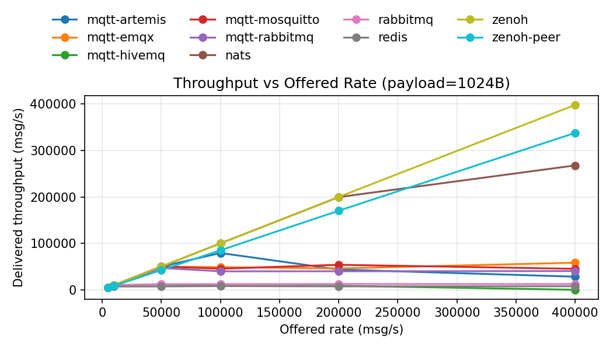

- zenoh scales almost linearly to 400k offered, delivering ≈398k/s at the top end with minor drop from offered.
- NATS reaches ≈268k/s at 400k offered before levelling; p99 (below) indicates rising tail latency near that point.
- zenoh-peer delivers ≈338k/s at 400k offered; good scaling but below zenoh at the extreme.
- Redis caps around 7–8k/s independent of offered rate; extremely low latency but small throughput envelope.
- RabbitMQ holds ~12–15k/s regardless of offered rate; heavy queueing shows up in latency.

### payload=4096B

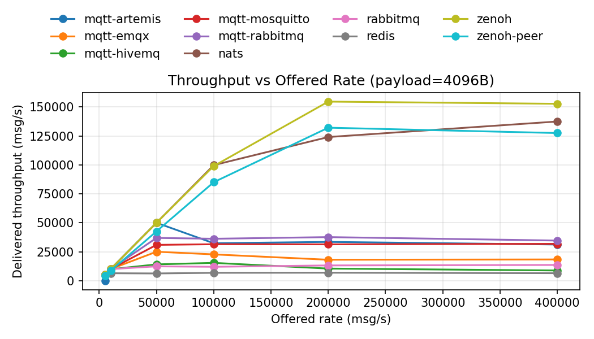

- zenoh saturation appears around 150–160k/s; at 400k offered it delivers ≈153k/s.
- NATS tops out ≈137k/s by 400k offered, tracking a similar “payload-limited” crest.
- zenoh-peer reaches ≈128k/s at 400k offered, consistent with the payload-induced ceiling.
- Redis remains at ~6–7k/s.
- RabbitMQ stays ~12–15k/s, insensitive to higher offered rates.

### payload=16384B

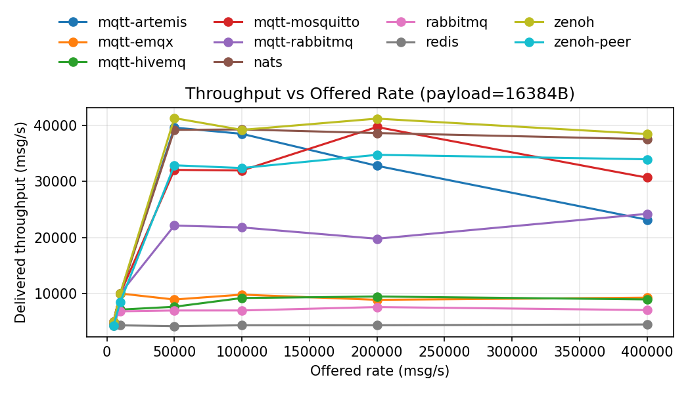

- All high-speed brokers converge around ~35–41k/s: zenoh ~38–41k/s, NATS ~37–39k/s, zenoh-peer ~32–35k/s.
- Redis lands ~4.1–4.5k/s; RabbitMQ again ~12–15k/s.
- The near-flat curves reflect payload-bound throughput; increasing offered rate just deepens queues/latency.

## P99 latency vs Offered Rate

### payload=1024B

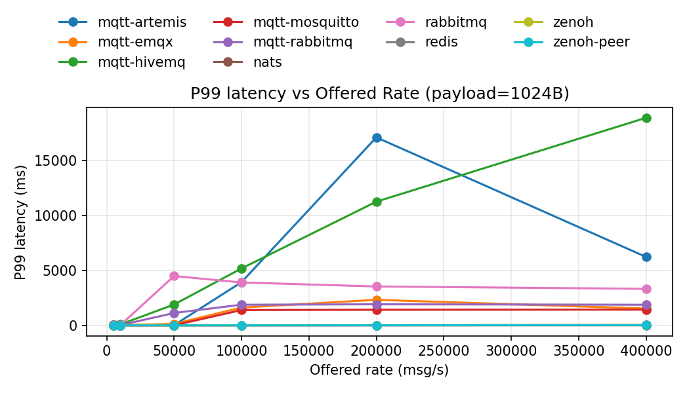

- zenoh p99 grows from ~4–5 ms at low rates to ~30 ms at 400k/s — typical tail growth at saturation.
- NATS p99 remains sub-ms at moderate rates, stretching to ~26 ms near 400k/s as it saturates.
- zenoh-peer stays very low through mid-rates and climbs into tens of ms at the top end.
- Redis maintains sub-0.3 ms p99 even as offered rate increases — but throughput caps early.
- RabbitMQ p99 explodes into seconds under overload, indicating deep queuing.

### payload=4096B

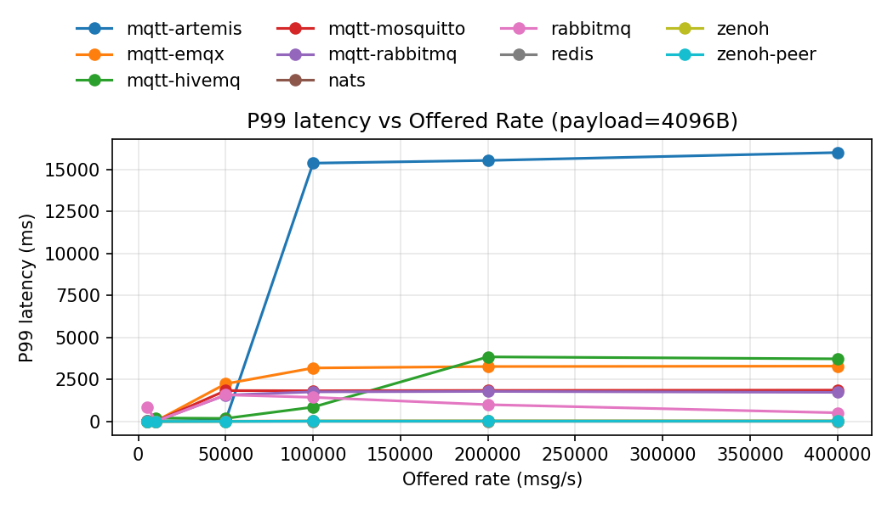

- zenoh p99 rises toward mid–high tens of ms approaching its ~150k/s ceiling.
- NATS p99 jumps sharply after ~50–100k/s, mirroring its throughput crest.
- zenoh-peer remains low until high offered rates, then climbs to ~20 ms.
- Redis stays sub-0.3 ms; RabbitMQ rises to multi-second p99 when overloaded.

### payload=16384B

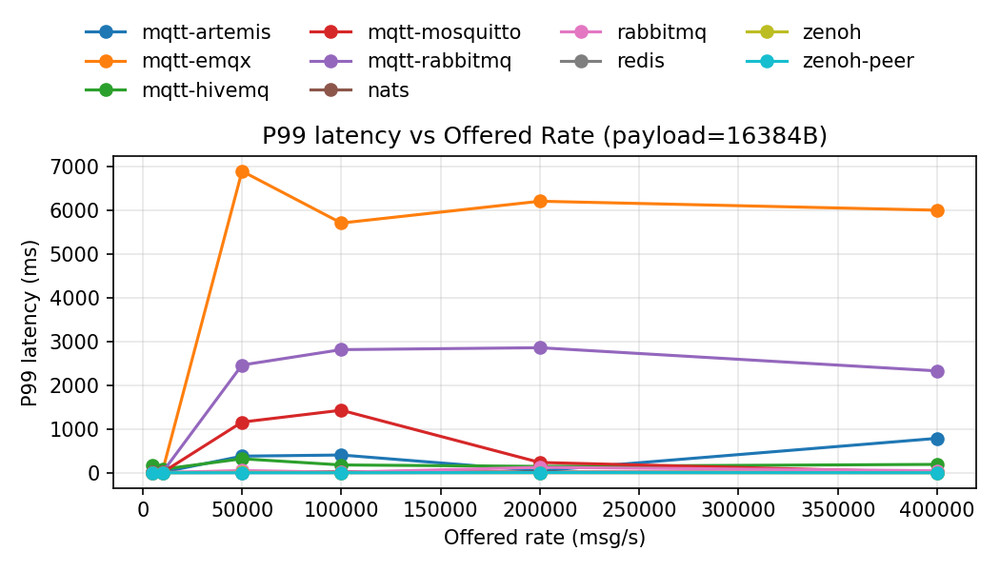

- With all systems payload-bound near ~35–41k/s, p99s are comparatively modest (generally under a few tens of ms for zenoh/NATS/zenoh-peer) at or near their plateaus.
- Redis remains consistently low (≈0.3 ms); RabbitMQ reflects heavy queueing even at moderate rates.

## Max CPU% vs Offered Rate

### payload=1024B

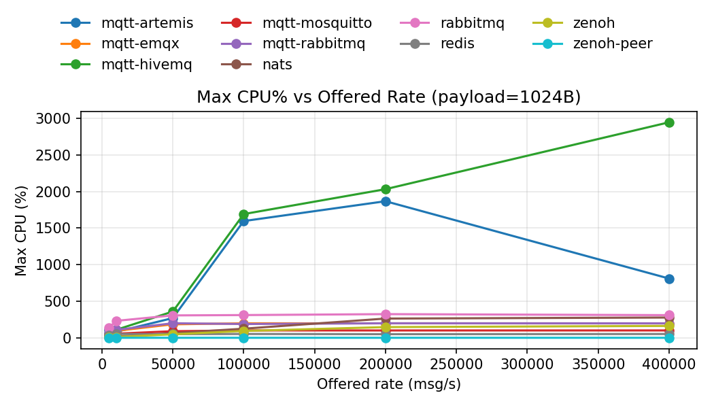

- zenoh CPU scales with load, reaching >150% near 400k/s; consistent with pushing multiple cores.
- NATS also climbs steeply into multi-core utilization at high rates.
- zenoh-peer reports very low CPU in this run (<1% recorded), likely a measurement-location artifact; relative trend vs rate still increases.
- Redis holds ~40–55% across rates; RabbitMQ reaches ~300%+ while still throughput-limited.

### payload=4096B

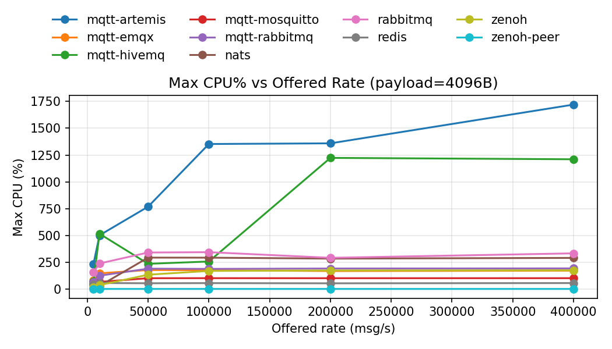

- zenoh and NATS hit high CPU before/around their ~130–160k/s ceilings.
- zenoh-peer stays low in recorded CPU; trend rises slightly with rate.
- Redis ~42–56%; RabbitMQ ~290–310% across rates.

### payload=16384B

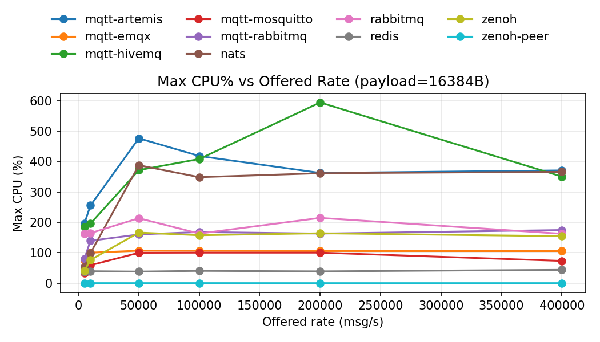

- NATS shows the highest recorded CPU among the brokers at these payloads.
- zenoh levels in the ~150–170% range at plateau throughput.
- zenoh-peer again reports very low CPU here; Redis ~38–44%; RabbitMQ ~310% at low rates as well.

## Max Memory% vs Offered Rate

### payload=1024B

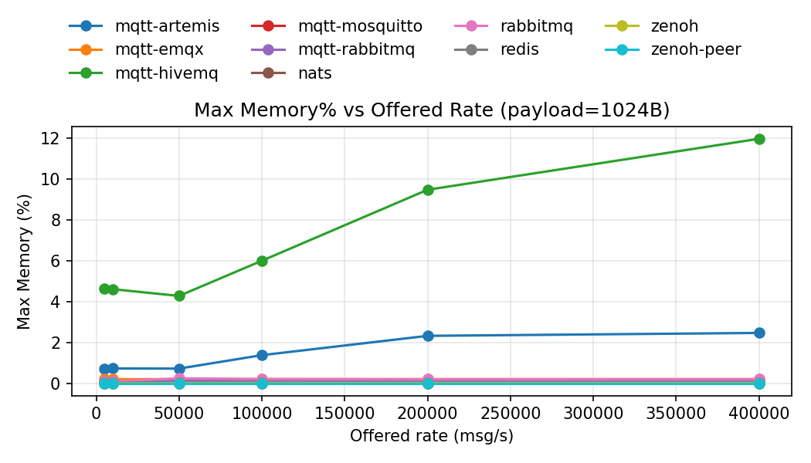

- Redis holds steady at ≈60 MB resident; others remain in the low-MB range, except RabbitMQ that grows into hundreds of MB.

### payload=4096B

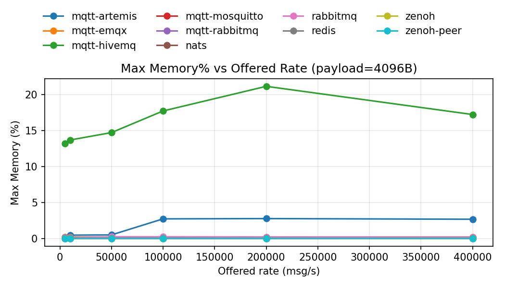

- Similar profile: Redis steady; zenoh/NATS/zenoh-peer minimal; RabbitMQ remains high.

### payload=16384B

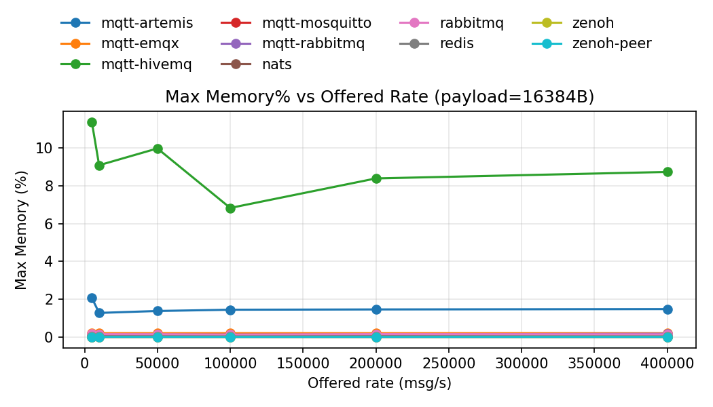

- Memory usage remains largely flat vs rate for most brokers; RabbitMQ footprint dominates.

## Fanout: Delivered throughput

### payload=1024B — rate=1000/s

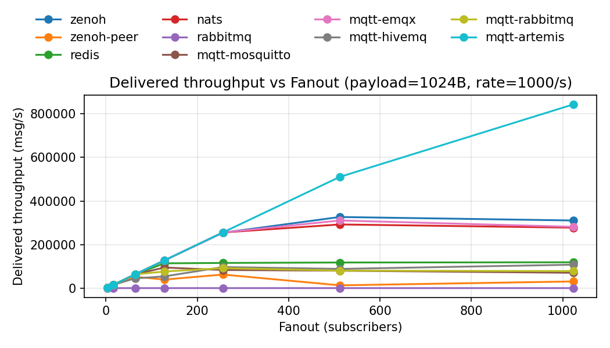

- At modest rate, delivered throughput scales roughly linearly with fanout for all brokers until resource limits appear; zenoh/NATS typically sustain near the offered total per subscriber set.

### payload=4096B — rate=1000/s

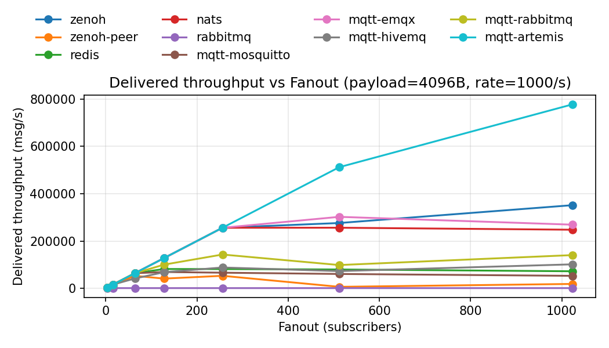

- Larger payloads slightly reduce the maximum sustainable fanout before throughput starts tapering, but scaling remains near-linear at low fanout.

### payload=16384B — rate=1000/s

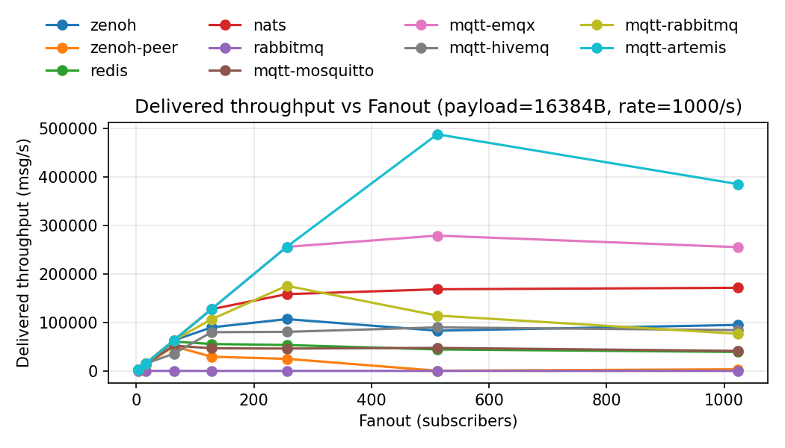

- With 16 KB messages, the per-subscriber budget tightens; systems hold near offered totals at low fanout, then flatten earlier.

## Fanout: Max CPU%

### payload=1024B — rate=1000/s

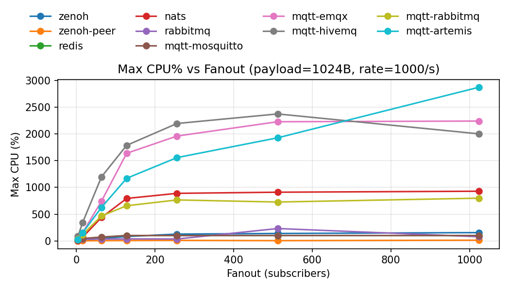

- CPU rises with fanout as expected; zenoh/NATS show steeper slopes; Redis is moderate; RabbitMQ grows but without matching throughput gains.

### payload=4096B — rate=1000/s

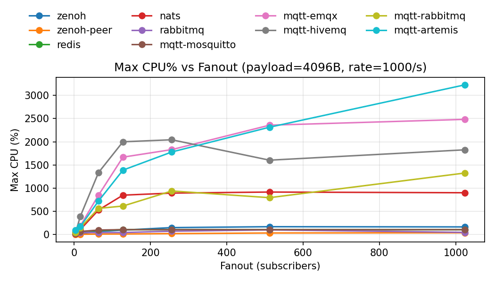

- With larger payloads, CPU scales similarly but hits the plateau earlier in fanout.

### payload=16384B — rate=1000/s

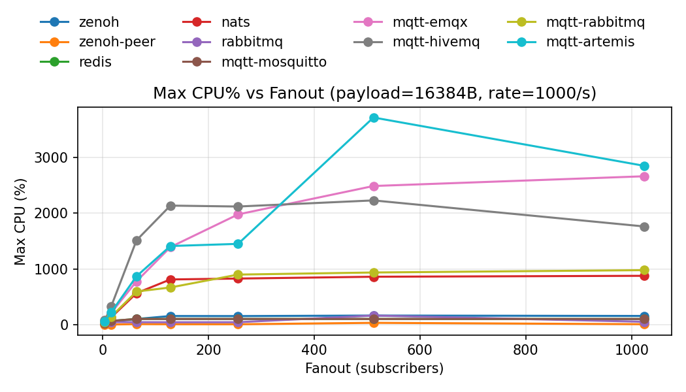

- The CPU-vs-fanout curves flatten earlier, reflecting payload-bound throughput.

## Fanout: Max Memory%

### payload=1024B — rate=1000/s

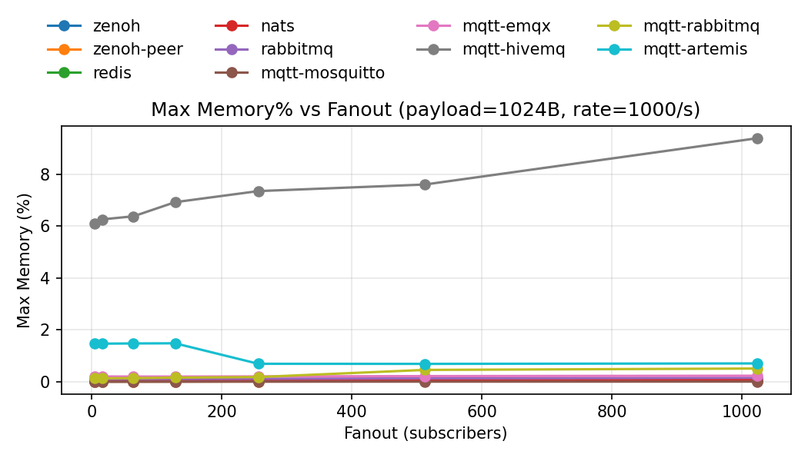

- Memory grows slowly with fanout for most systems; HiveMQ’s footprint is the largest.

### payload=4096B — rate=1000/s

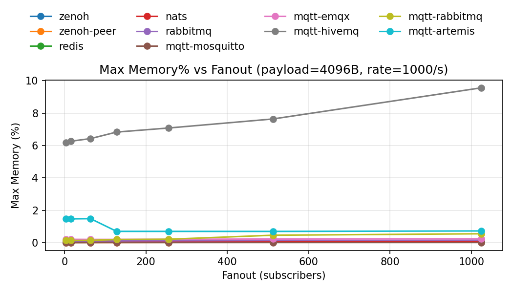

- Trends are similar to 1024B; memory remains mostly stable per process with slight increases.

### payload=16384B — rate=1000/s

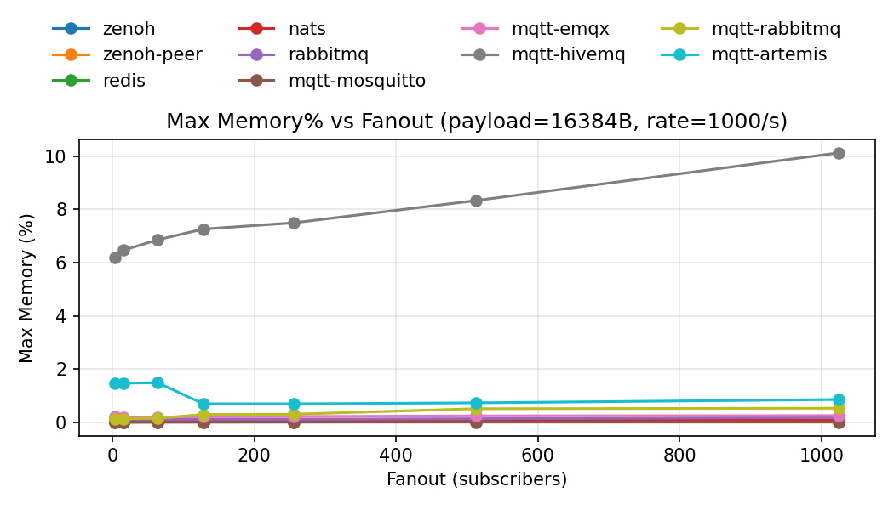

- Payload size has a modest effect on memory at these rates; HiveMQ remains the outlier.

---

## Conclusions

- For high message rates with small payloads, zenoh leads on delivered throughput at 400k offered with moderate tail latencies; NATS follows closely with slightly lower throughput and similar tail growth. zenoh-peer performs well but under zenoh at the extreme.
- With larger payloads (4–16 KB), all brokers become payload-bound; expect ceilings around ~130–160k/s (4 KB) and ~35–41k/s (16 KB) for the faster systems.
- Redis provides excellent low latency but low throughput; RabbitMQ exhibits stable (but comparatively low) throughput with significant queuing and latency when pushed beyond its envelope.

Reproduction note: these results came from a specific host and measurement setup; absolute numbers will vary across hardware and topology, but the relative trends should generalize.

