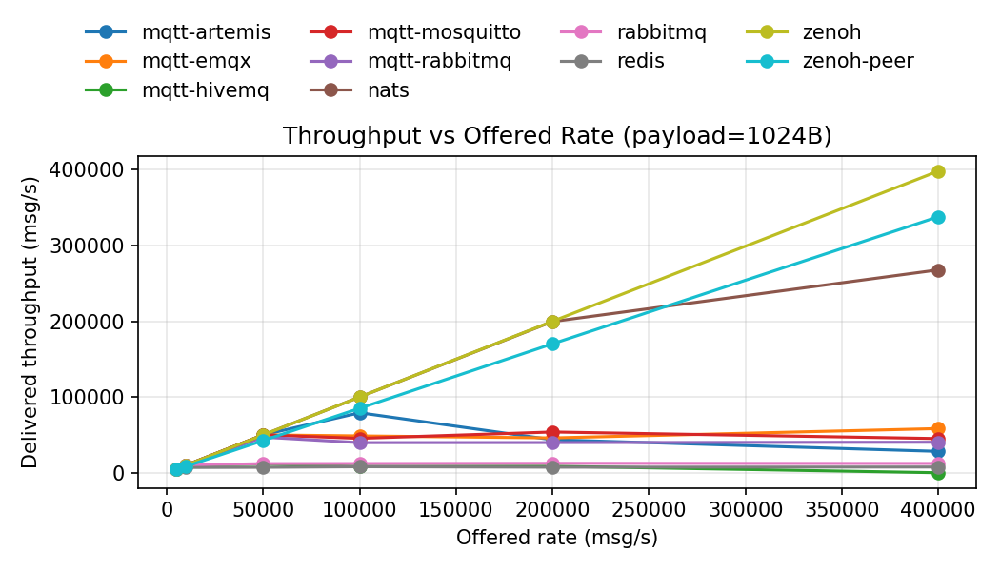
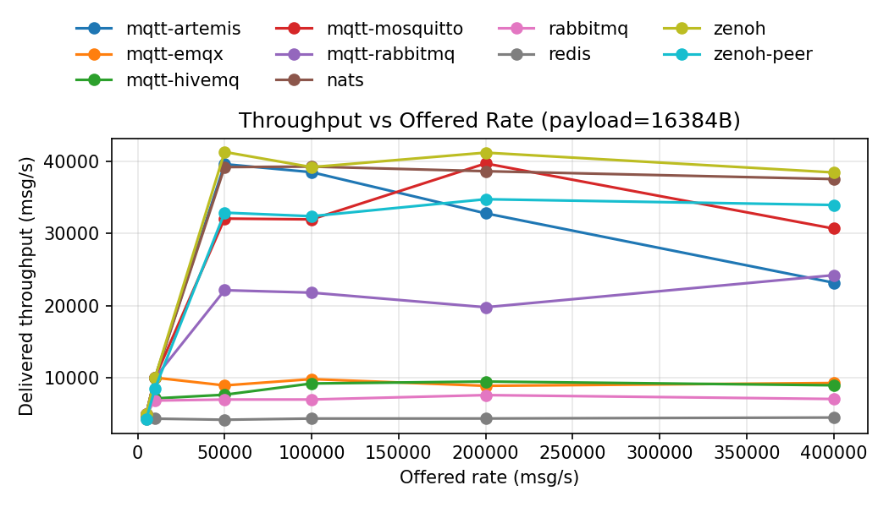
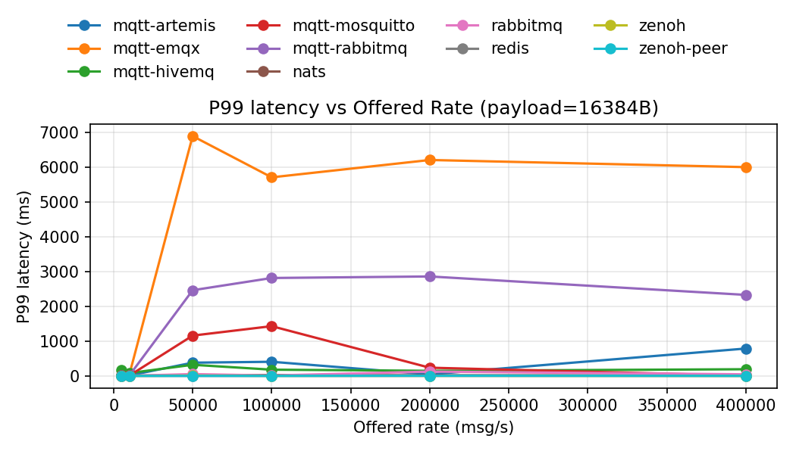
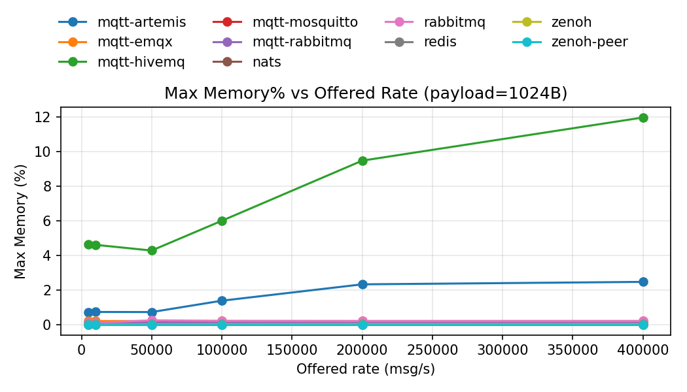
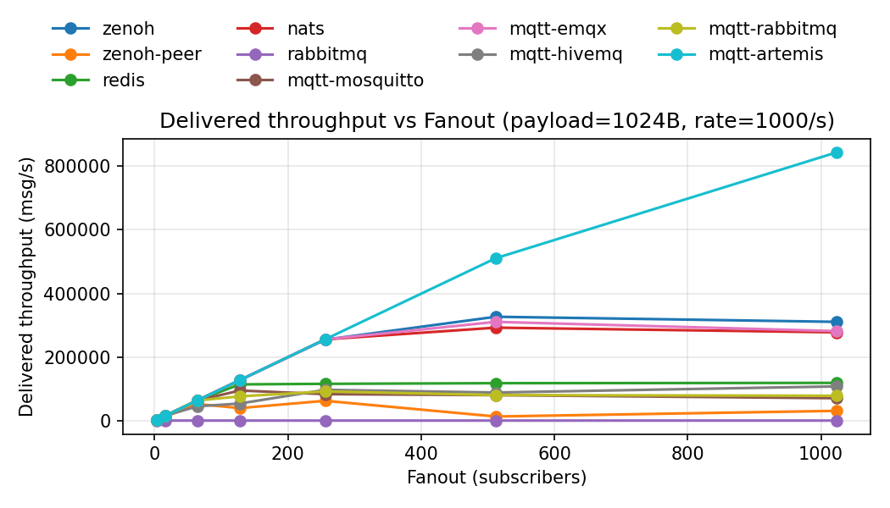
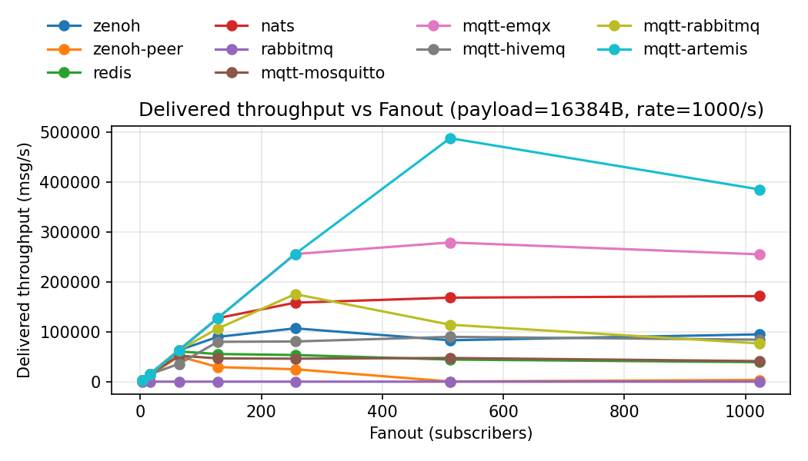
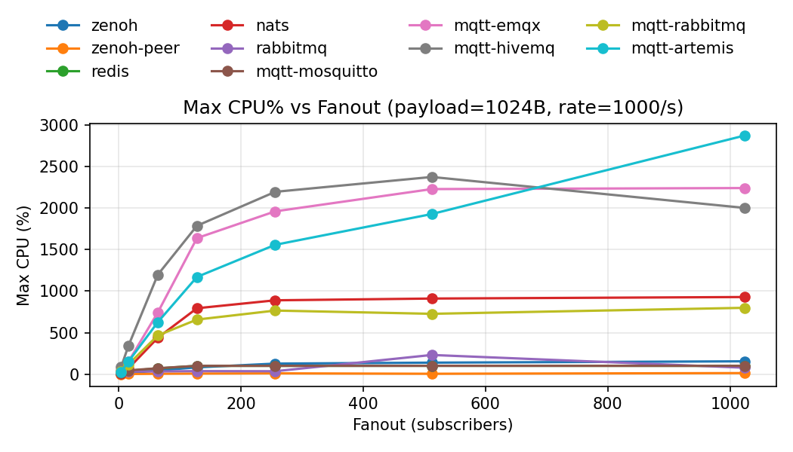
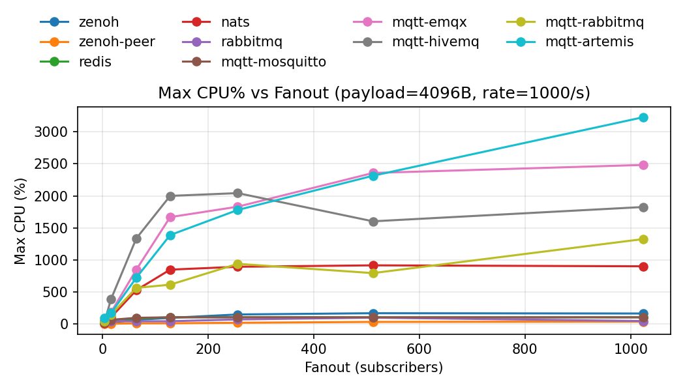
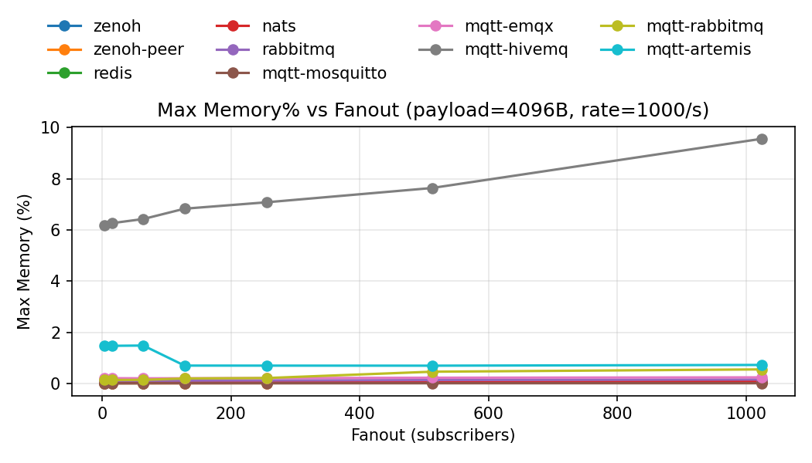

# Benchmark plots

- Summary: `/home/cc/mq-bench/results/benchmark_20250910_034853/raw_data/summary.csv`

## Table of contents

- [Throughput vs Offered Rate](#throughput-vs-offered-rate)
- [P99 latency vs Offered Rate](#p99-latency-vs-offered-rate)
- [Max CPU% vs Offered Rate](#max-cpu-vs-offered-rate)
- [Max Memory% vs Offered Rate](#max-memory-vs-offered-rate)
- [Fanout: Delivered throughput](#fanout-delivered-throughput)
- [Fanout: Max CPU%](#fanout-max-cpu)
- [Fanout: Max Memory%](#fanout-max-memory)

## Throughput vs Offered Rate

### payload=1024B

### payload=4096B

### payload=16384B

## P99 latency vs Offered Rate

### payload=1024B

### payload=4096B

### payload=16384B

## Max CPU% vs Offered Rate

### payload=1024B

### payload=4096B

### payload=16384B

## Max Memory% vs Offered Rate

### payload=1024B

### payload=4096B

### payload=16384B

## Fanout: Delivered throughput

### payload=1024B

#### rate=1000/s

### payload=4096B

#### rate=1000/s

### payload=16384B

#### rate=1000/s

## Fanout: Max CPU%

### payload=1024B

#### rate=1000/s

### payload=4096B

#### rate=1000/s

### payload=16384B

#### rate=1000/s

## Fanout: Max Memory%

### payload=1024B

#### rate=1000/s

### payload=4096B

#### rate=1000/s

### payload=16384B

#### rate=1000/s

