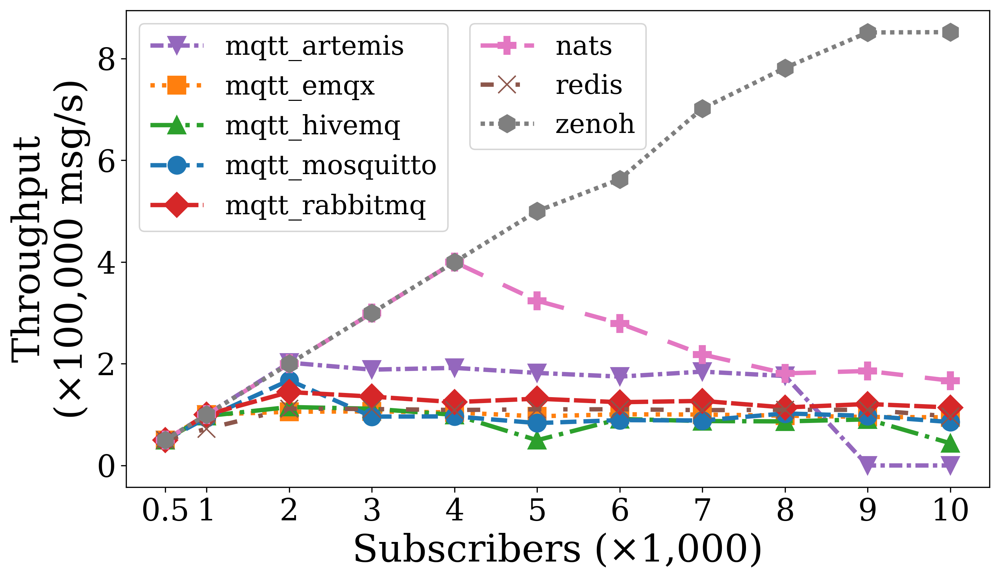
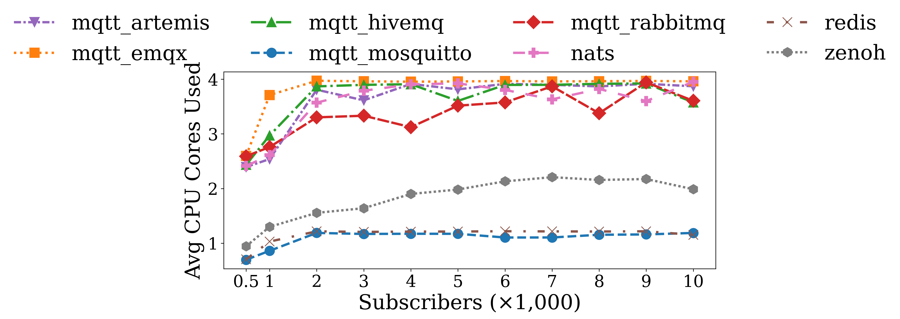
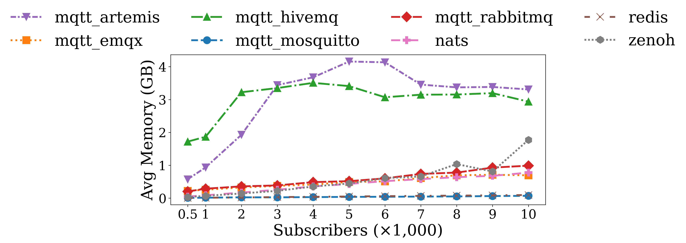

# Fanout Topology: Throughput, CPU, and Memory Analysis

## Experiment Setup

A single publisher sends **100 msg/s** to a shared topic while *N* subscribers (500–10,000) each receive every message, yielding an aggregate target of *N* × 100 msg/s. This isolates the broker's dispatch path from its ingestion cost. All experiments run on the **4 vCPU, 8 GB RAM** VM with 1 KB payloads.

> **Note on rate selection:** We use 100 msg/s here instead of the 10 msg/s rate used in the 1-to-1 topology. Because there is only one publisher in the fanout setup, keeping 10 msg/s would place negligible load on the brokers, so we increased the message rate to stress the dispatch path and expose saturation behavior. Because of this rate difference, raw fanout numbers should not be directly compared with 1-to-1 results in absolute terms.

---

## Throughput vs. Subscriber Count

### Key Observations

**Zenoh** dominates the fanout topology, sustaining near-perfect throughput up to 5,000 subscribers (500K msg/s) and reaching **852K msg/s at 10,000 subscribers**. This is a dramatic departure from 1-to-1, where Zenoh and NATS performed comparably at ~90K msg/s. In fanout, Zenoh is **5× higher than NATS** at 10,000 subscribers, suggesting an efficient broadcast dispatch path that avoids per-subscriber copy overhead.

**NATS** delivers the full target up to 4,000 subscribers (400K msg/s) but collapses beyond — dropping to **167K msg/s at 10,000 subscribers**. In 1-to-1, NATS matched Zenoh; in fanout, its dispatch cost scales linearly with subscriber count, exhausting all four CPU cores.

**Artemis** peaks at **202K msg/s at 2,000 subscribers** (~3× its 1-to-1 peak of 70K), but degrades with more subscribers and **fails at 9,000+** due to JVM GC pressure.

**RabbitMQ-MQTT** sustains a stable **114–144K msg/s** plateau from 2,000 to 10,000 subscribers (~2.5× its 1-to-1 peak), showing that Erlang's process model handles broadcast efficiently.

**EMQX** saturates at **95–106K msg/s** beyond 1,000 subscribers — roughly a 2× gain over its 1-to-1 ceiling of ~47K msg/s — but reaches CPU saturation early.

**Mosquitto** peaks at **168K msg/s at 2,000 subscribers** but fluctuates between 83–102K at higher counts. Fanout roughly doubles its 1-to-1 ceiling of ~45K: the single event-loop handles "one ingest, many dispatches" more efficiently, but still hits its single-core ceiling.

**Redis** plateaus at ~**110K msg/s** from 2,000 subscribers onward — a 3.5× gain over 1-to-1 (~30K) — but the single-threaded event loop caps total dispatch throughput.

**HiveMQ** peaks at **115K msg/s at 2,000 subscribers**, then shows erratic behavior (50K–90K), collapsing to **44K at 10,000**. GC pauses cause intermittent throughput drops, mirroring the instability seen in 1-to-1.

### Summary Table: Peak and 10K-Subscriber Throughput

| Broker | Peak Throughput (msg/s) | At N Subs | Throughput @ 10K Subs | 1-to-1 Peak (msg/s) | Fanout vs. 1-to-1 |
|---|---|---|---|---|---|
| **Zenoh** | 852K | 10,000 | 852K | 90K | **~9.5×** |
| **NATS** | 400K | 4,000 | 167K | 90K | 1.9× (at 10K) |
| **Artemis** | 202K | 2,000 | Failed | 70K | 2.9× (at peak) |
| **Mosquitto** | 168K | 2,000 | 85K | 45K | 1.9× (at 10K) |
| **RabbitMQ** | 144K | 2,000 | 114K | 50K | 2.3× (at 10K) |
| **HiveMQ** | 115K | 2,000 | 44K | 40K | 1.1× (at 10K) |
| **Redis** | 112K | 2,000 | 96K | 30K | 3.2× (at 10K) |
| **EMQX** | 106K | 2,000 | 95K | 47K | 2.0× (at 10K) |

---

## CPU Utilization vs. Subscriber Count

### Key Observations

**Zenoh** achieves 852K msg/s using only **~2.0 cores** — well below the 4-core ceiling — yielding **~426K msg/s per core**. In 1-to-1, Zenoh used ~3.2 cores for 90K msg/s (28K per core), so fanout per-core efficiency is **~15× higher**. This is the most striking insight: Zenoh's dispatch cost is largely independent of subscriber count, implying zero-copy or batched broadcast semantics.

**NATS** saturates all **4 cores** (~3.95 avg) from 3,000 subscribers onward — even as throughput collapses to 167K msg/s at 10,000 subs (42K msg/s per core). This confirms O(N) per-subscriber dispatch: each message is copied individually, consuming CPU without proportional throughput gains. Its per-core efficiency is actually *worse* than in 1-to-1 (26K per core).

**Redis** and **Mosquitto** hold consistent **~1.2 core** ceilings regardless of subscriber count, mirroring their 1-to-1 behavior. The single-threaded event loop is the binding constraint in both topologies; fanout gains come from avoiding per-publisher ingestion overhead, not additional CPU headroom.

**EMQX** saturates at **~3.97 cores** from 2,000 subscribers onward, matching its 1-to-1 profile. Despite consuming all available compute, it cannot push beyond ~100K msg/s.

**HiveMQ** and **Artemis** both saturate near **3.9 cores**. HiveMQ's throughput is erratic (50K–115K msg/s), pointing to GC pauses. Artemis reaches 3.91 cores at 4,000 subscribers before failing at 9,000+.

**RabbitMQ-MQTT** scales from **2.6 to 3.9 cores** proportionally with subscribers. At 10,000 subscribers it achieves 32K msg/s per core — an improvement over its 1-to-1 efficiency of 12.5K per core.

### Throughput-per-Core Efficiency

| Broker | Fanout msg/s per core (10K subs) | 1-to-1 msg/s per core (peak) | Efficiency Ratio |
|---|---|---|---|
| **Zenoh** | ~426K | ~28K | **15.2×** |
| **Redis** | ~83K | ~27K | 3.1× |
| **Mosquitto** | ~72K | ~41K | 1.8× |
| **NATS** | ~42K | ~26K | 1.6× |
| **RabbitMQ** | ~32K | ~13K | 2.5× |
| **EMQX** | ~24K | ~12K | 2.0× |
| **HiveMQ** | ~12K | ~11K | 1.1× |

---

## Memory Footprint vs. Subscriber Count

### Key Observations

**Redis** and **Mosquitto** are the most memory-efficient brokers, consuming only **8–95 MB** and **8–70 MB** respectively across all subscriber counts. Redis's profile is nearly identical to 1-to-1 (~10–90 MB), confirming its memory scales with connection state alone. Mosquitto is actually *more* memory-efficient in fanout than in 1-to-1 (where it reached 620 MB), because a single shared topic replaces thousands of per-topic buffers.

**Zenoh** grows gradually from **33 MB to ~810 MB** (500–9,000 subs), then jumps to **1,774 MB at 10,000** — coinciding with its throughput ceiling, suggesting internal buffer accumulation when dispatch lags. Comparable to its 1-to-1 profile (59–1,242 MB) at equivalent scales.

**NATS** grows linearly from **47 to 781 MB** (~75 MB per 1,000 subscribers). Lower than 1-to-1 (68–1,163 MB), likely because shared subscriptions replace per-topic state.

**EMQX** consumes **222–711 MB** — a major improvement over its 1-to-1 range (268–3,741 MB), where Erlang process proliferation under many connections dominated. The single publisher in fanout dramatically reduces this overhead.

**RabbitMQ-MQTT** ranges from **203–988 MB**, significantly better than 1-to-1 (255–5,519 MB). The shared fanout exchange avoids per-queue memory for thousands of individual topic bindings.

**Artemis** starts at **573 MB** (JVM heap) and balloons to **4,159 MB at 5,000 subs**, matching its 1-to-1 profile. JVM heap management dominates over topology-specific factors. Failures at 9,000+ subscribers align with peak memory.

**HiveMQ** has the highest baseline at **1,720 MB at 500 subscribers**, peaking at 3.5 GB. Intermittent spikes to 5.6 GB coincide with throughput drops, suggesting GC storms. The fanout profile is comparable to 1-to-1 (521–3,353 MB), indicating JVM heap is the binding constraint regardless of topology.

### Memory at 10,000 Subscribers

| Broker | Avg Memory (MB) | Throughput (msg/s) | MB per 100K msg/s |
|---|---|---|---|
| **Redis** | 95 | 96K | 99 |
| **Mosquitto** | 70 | 85K | 82 |
| **NATS** | 781 | 167K | 468 |
| **EMQX** | 696 | 95K | 732 |
| **RabbitMQ** | 988 | 114K | 867 |
| **Zenoh** | 1,774 | 852K | 208 |
| **HiveMQ** | 2,939 | 44K | 6,680 |
| **Artemis** | Failed | — | — |

---

## Cross-Dimensional Analysis

1. **Zenoh's broadcast efficiency is the defining result.** It delivers 852K msg/s using just 2 cores and 1.8 GB — implying a zero-copy or shared-buffer broadcast where dispatch cost is amortized across subscribers. This advantage is invisible in 1-to-1 and only surfaces under fan-out.

2. **NATS reveals a per-subscriber copy bottleneck.** Throughput collapses above 4,000 subscribers while CPU stays saturated at 4 cores — classic O(N) dispatch behavior. In 1-to-1, low per-publisher rates hide this; fanout's 100 msg/s × N subscribers exposes it.

3. **Single-threaded brokers (Redis, Mosquitto) are CPU-bound but memory-efficient.** Both ceiling at ~1.2 cores with minimal memory. Their improved fanout throughput (vs. 1-to-1) comes from freeing the event loop from per-publisher ingestion overhead.

4. **Managed-runtime brokers trade memory for stability.** EMQX (696 MB), RabbitMQ (988 MB), and HiveMQ (2.9 GB) all saturate ~4 cores for 95–144K msg/s. All show *lower* memory in fanout than 1-to-1 due to reduced per-connection overhead.

5. **JVM brokers (HiveMQ, Artemis) are the least predictable.** Erratic throughput correlated with memory spikes indicates GC-induced pauses. Fanout amplifies GC pressure as buffered messages for thousands of subscribers accumulate during pauses.

### Fanout vs. 1-to-1: Key Shifts

| Metric | 1-to-1 Topology | Fanout Topology | Insight |
|---|---|---|---|
| **Top throughput** | Zenoh ≈ NATS (90K) | Zenoh (852K) >> NATS (400K→167K) | Fanout exposes dispatch architecture |
| **CPU bottleneck** | NATS/Zenoh both ~3.5 cores | NATS saturates at 4; Zenoh only ~2 | Broadcast efficiency vs. per-sub copy |
| **Memory leader** | Redis (10–90 MB) | Redis (8–95 MB) | Unchanged — topology-independent |
| **Biggest improvement** | — | Redis: 30K → 112K (3.7×) | Single ingest removes I/O bottleneck |
| **Most surprising** | — | Artemis: 70K → 202K (2.9×) | JVM batch dispatch benefits fanout briefly |
| **Least improved** | — | HiveMQ: 40K → 44K (1.1× at 10K) | GC overhead dominates topology gains |

### Takeaway

> Performance trends from 1-to-1 topologies generally carry over to fanout, but topology can shift bottlenecks and flip relative rankings. Zenoh, which matched NATS in 1-to-1, dominates in fanout with near-linear throughput scaling and modest CPU usage, while NATS collapses beyond 4,000 subscribers despite saturating all four cores. Single-threaded brokers (Redis, Mosquitto) improve in fanout due to reduced ingestion overhead but remain CPU-bound. Managed-runtime brokers benefit from lower per-connection memory pressure in fanout, but their throughput ceilings remain limited by GC and per-subscriber dispatch costs.
