# Bursty Fan-Out Plots

- Summary: `/home/cc/mq-bench/results/fanout_bursty_load_20260612_180033/raw_data/summary_by_phase.csv`
- Plot points: `/home/cc/mq-bench/results/fanout_bursty_load_20260612_180033/raw_data/plot_points.csv`

## Legend

## Delivery Throughput vs Time

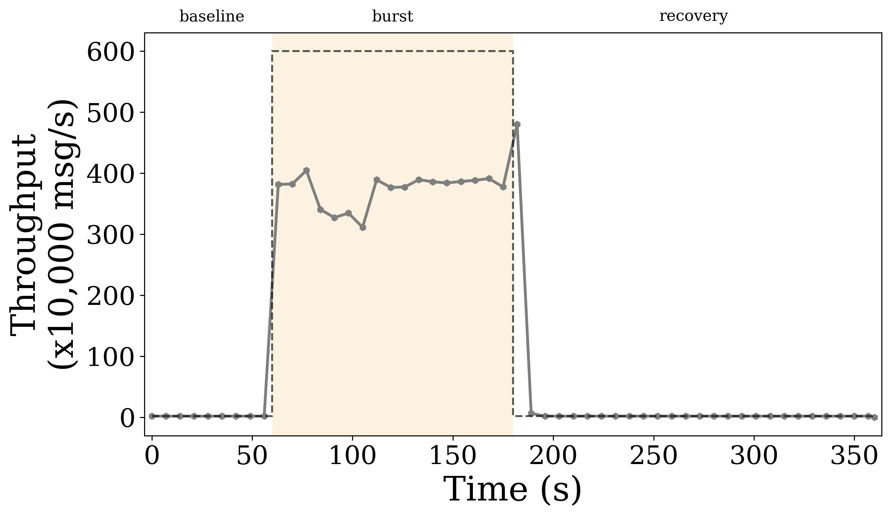

## P99 Latency vs Time

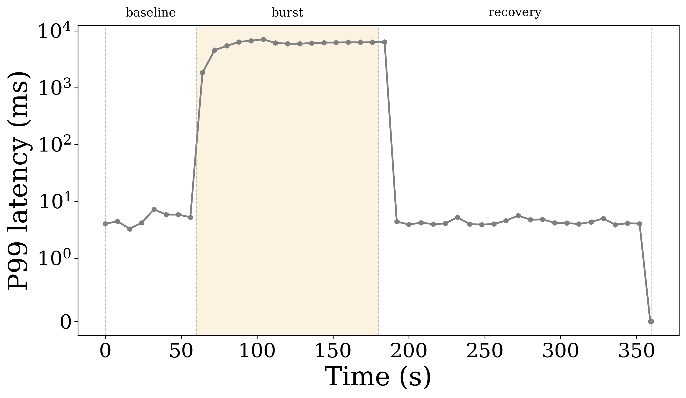

## P95 Latency vs Time

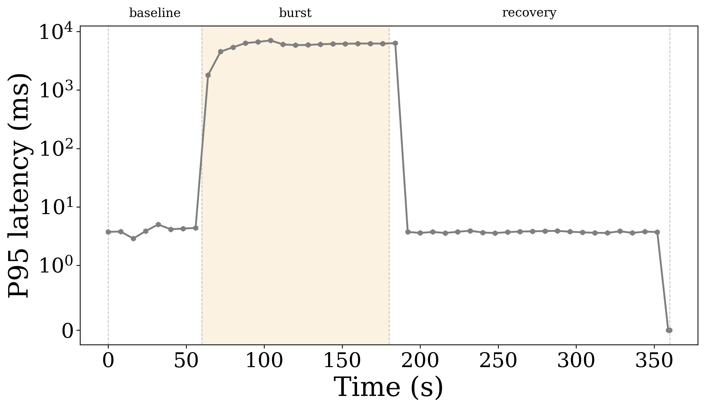

## P50 Latency vs Time

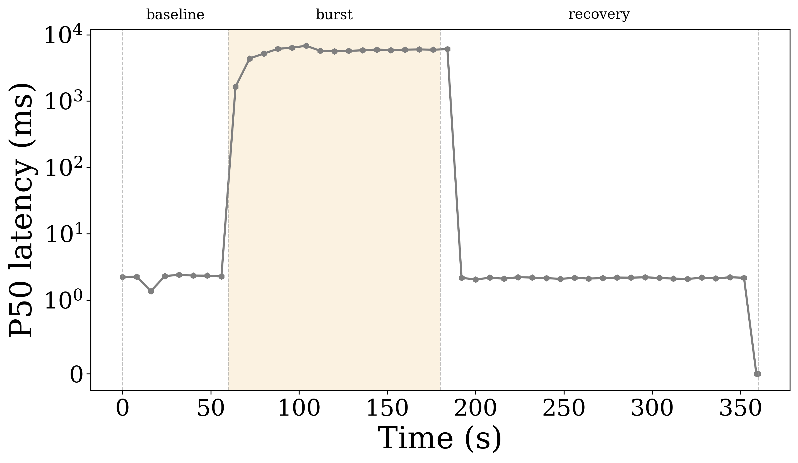

## Average Latency vs Time

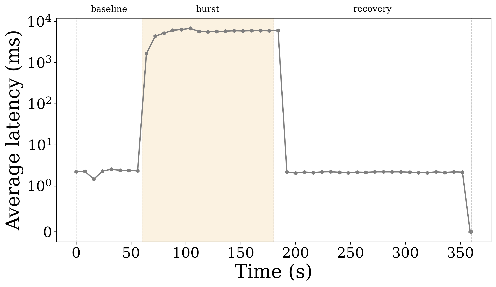

## CPU vs Time

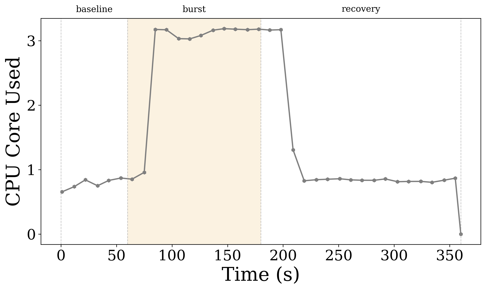

## Memory vs Time

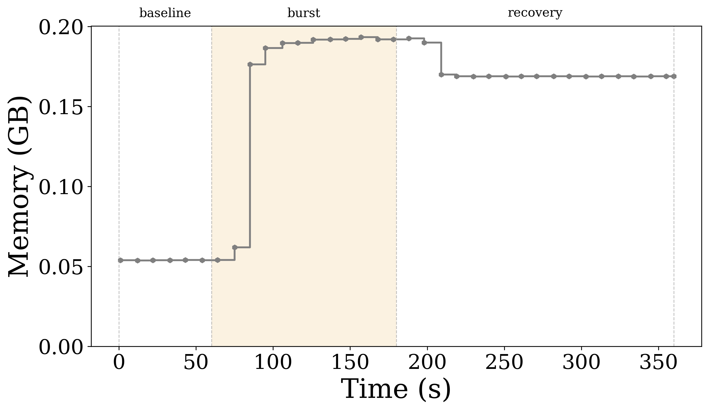

## Network TX vs Time

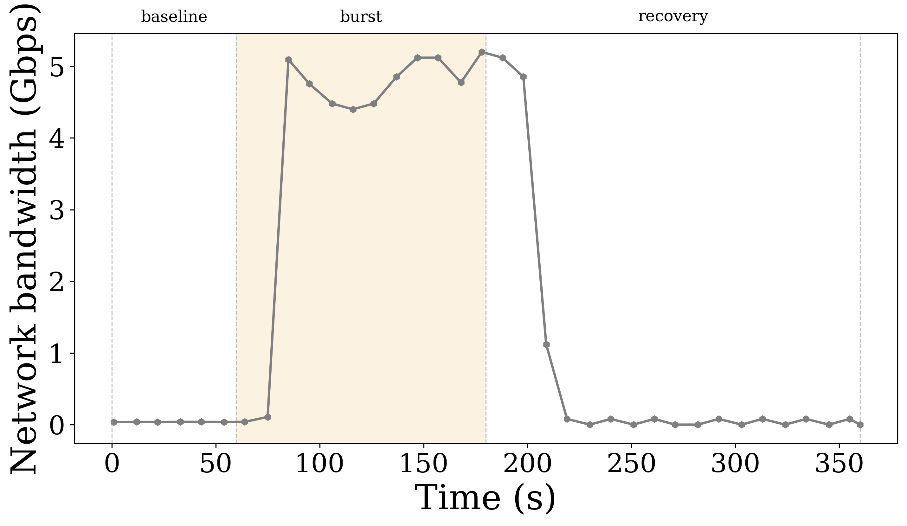

## Latency Quartile Boxplot by Phase

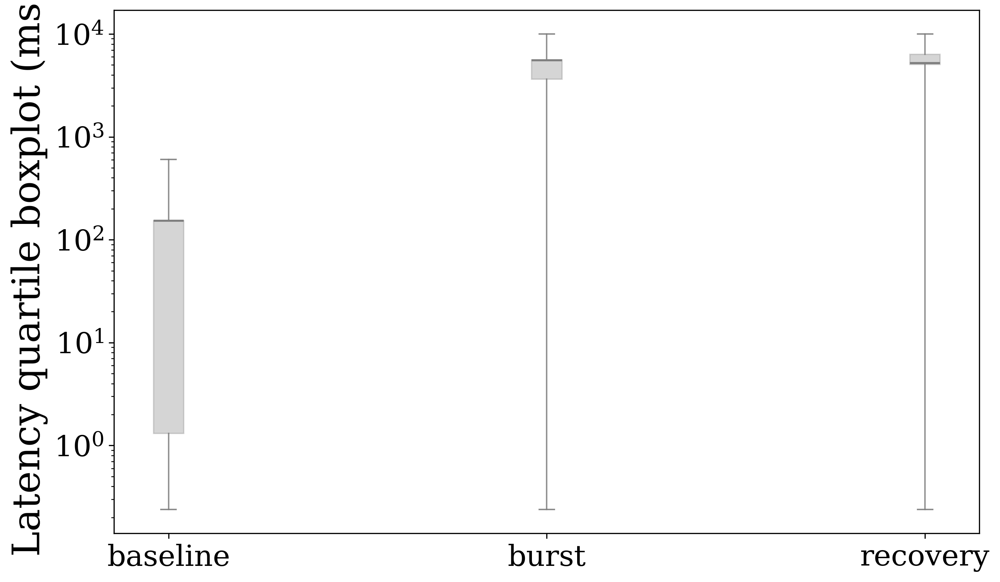

## Phase P99 Latency

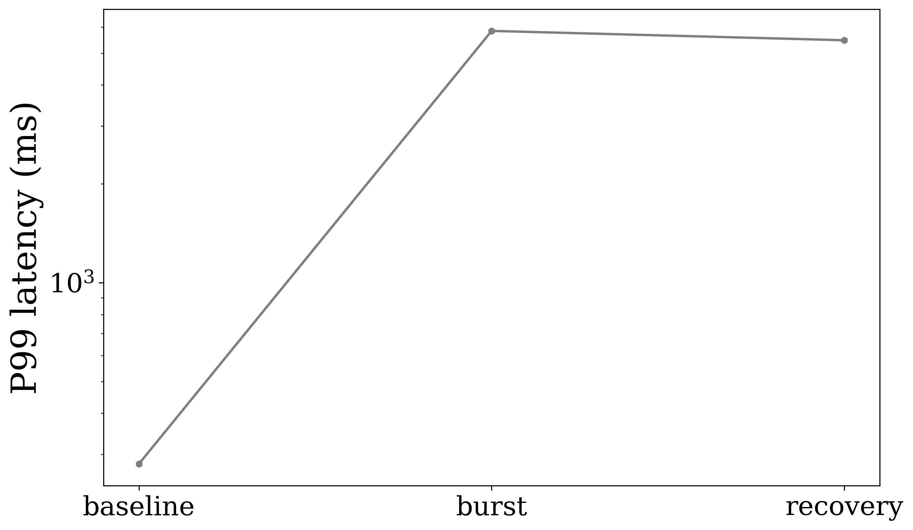

## Phase Average Latency

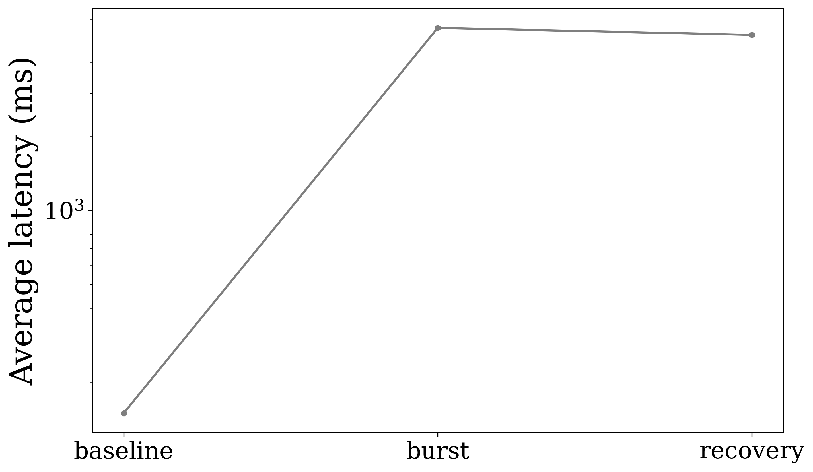

## Phase Delivery Throughput

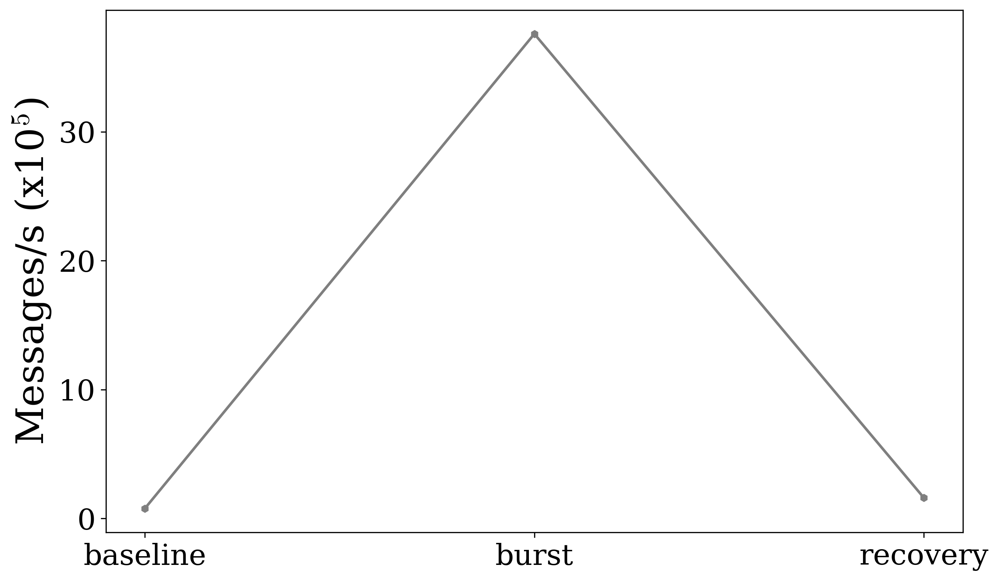

## Phase CPU

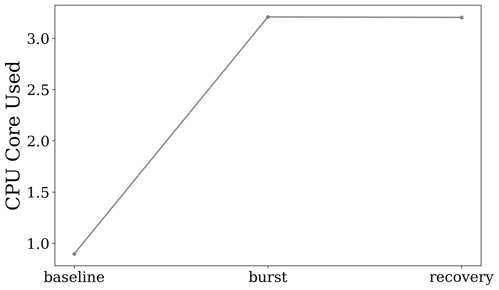

## Phase Memory

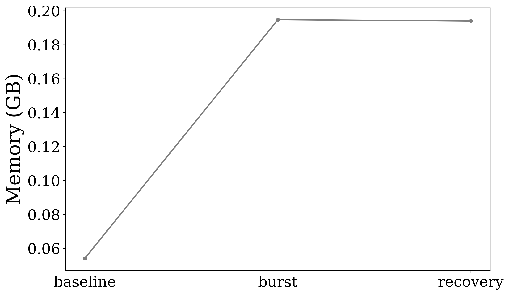

